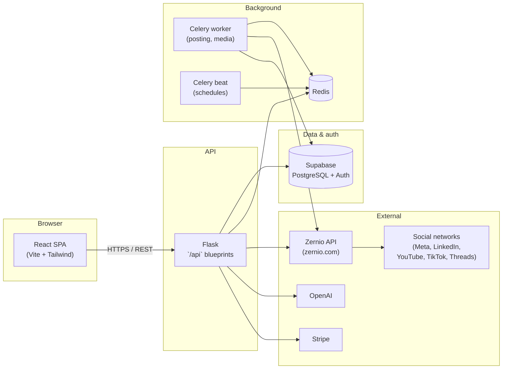

# POSTWAND - Social Media Manager SaaS

POSTWAND is a comprehensive full-stack Social Media Management platform designed to streamline content creation, scheduling, and multi-platform publishing. Leveraging AI, it helps brands automate their social media presence across Facebook, Instagram, LinkedIn, YouTube, TikTok, Threads, and more.

Social scheduling and platform connectivity are powered in part by the **[Zernio](https://zernio.com)** API — “Social APIs for developers and AI agents.” Thanks to the **[@zernio-dev](https://github.com/zernio-dev)** team for the product and open SDKs; see their [GitHub organization](https://github.com/zernio-dev) for official clients (Node, Python, CLI, and more).

## 🎥 Demo

<video src="https://github.com/user-attachments/assets/c053df65-ba33-41cc-a888-b321ad418fd6" controls muted playsinline width="100%"></video>

## 🔗 Quick links

- [Features](#features)
- [Architecture](#architecture)
- [Getting Started](#getting-started)
- [Environment Variables](#environment-variables)
- [Supported Platforms](#supported-platforms)

## 🚀 Features

- **Multi-Platform Scheduling**: Schedule posts, stories, reels, and shorts for Facebook, Instagram, LinkedIn, YouTube, TikTok, and Threads from a single dashboard.
- **AI Content Generation**:
  - **Text**: Generate engaging post captions powered by OpenAI.
  - **Images**: Create and edit custom visual content with AI image generation.
  - **Video**: AI-assisted video content creation.
- **AI Agent**: Autonomous conversational agent that can plan content, generate captions, create images, check connected accounts, and schedule posts through a chat interface.
- **Brand Management**: Extract brand assets (logos, colors, fonts, images) from websites automatically and manage brand profiles with associated products.
- **Ad Creation Studio**: Generate ad copy and visuals with AI-powered ad engine.
- **Calendar View**: Visualize and manage scheduled content across day, week, month, and year views.
- **Account Management**: Connect and manage multiple social media accounts per platform via OAuth.
- **Subscription & Billing**: Stripe-powered subscription tiers (Creator, Manager, Business) with usage-based token limits.
- **Background Task Processing**: Reliable post delivery using Celery and Redis.
- **Internationalization**: Full multi-language support (English and Spanish) via i18next.

## 🛠️ Tech Stack

- **Frontend**: React 18, Vite 5, Tailwind CSS, Radix UI, MUI, i18next
- **Backend**: Python Flask, Celery, Redis
- **Database & Auth**: Supabase (PostgreSQL), Google OAuth
- **AI Services**: OpenAI API (text, images, video)
- **Payments**: Stripe (checkout, subscriptions, billing portal, webhooks)
- **Social API layer**: [Zernio](https://zernio.com) ([`zernio-dev` on GitHub](https://github.com/zernio-dev)) for unified social integrations used by scheduling and publishing flows
- **SSL**: mkcert for local HTTPS development

## 🏗️ Architecture

High-level request flow (browser → API → data, async work offloaded to workers):



### Repository layout

```
postwand2/
├── backend/
│   ├── app.py                  # Flask entry point & blueprint registration
│   ├── routes/                 # HTTP blueprints (auth, brands, integrations, scheduler, agent, stripe, etc.)
│   ├── services/               # Business logic
│   │   ├── agent/              # AI agent orchestrator & tools
│   │   ├── auth/               # Authentication & email verification
│   │   ├── brand_extraction/   # Website brand asset extraction
│   │   ├── create_text/        # AI text generation
│   │   ├── edit_images/        # AI image editing
│   │   ├── integrations/       # Platform OAuth & account management
│   │   │   └── platforms/      # Facebook, Instagram, LinkedIn, Threads, YouTube, TikTok
│   │   ├── scheduler/          # Post scheduling & execution
│   │   │   └── platforms/      # Platform-specific posting logic
│   │   ├── stripe/             # Payment & subscription management
│   │   └── ads/                # Ad creation service
│   ├── models/                 # Chat, image, video model abstractions
│   ├── ad_engine/              # Ad copy/visual generation
│   ├── database/               # Supabase DB access layer
│   ├── middlewares/            # Translation, JSON, COOP headers
│   ├── decorators/             # Auth decorators (login_required)
│   ├── utils/                  # Helpers (token usage, image utils)
│   ├── celery_worker.py        # Celery worker process
│   └── celery_scheduler.py     # Celery beat scheduler
├── frontend/
│   ├── vite.config.ts          # Vite config with HTTPS & API proxy
│   ├── src/
│   │   ├── pages/              # Feature pages (scheduler, calendar, agent, brands, etc.)
│   │   ├── components/         # UI primitives, uploaders, skeletons, pricing
│   │   ├── context/            # AuthContext, CreateTextContext
│   │   └── services/           # API client, Supabase client, i18n
│   └── public/locales/         # Translation files (en, es)
├── https_certs/                # SSL certificates for local dev
└── supabase/migrations/        # Database schema migrations
```

## 🚦 Getting Started

### Prerequisites

- Python 3.10+
- Node.js 18+ & npm
- Redis (for Celery background tasks)
- Supabase account
- mkcert (for local HTTPS certificates)

### Installation

1. **Clone the repository**:

```bash
git clone <repository_url>
cd postwand2
```

2. **Backend setup**:

```bash
cd backend
pip install -r requirements.txt
cp .env.example .env
# Edit .env with your credentials
```

3. **Frontend setup**:

```bash
cd ../frontend
npm install
```

4. **SSL certificates** (first time only):

```bash
# Install mkcert and create local CA
mkcert -install

# Generate certificates
cd https_certs
mkcert -key-file localhost+3-key.pem -cert-file localhost+3.pem localhost tiktok-dev.local 127.0.0.1 ::1
```

> **Windows/WSL users**: After generating certificates, install the root CA in Windows by running:
> ```bash
> certutil.exe -addstore -user "Root" "$(wslpath -w $(mkcert -CAROOT)/rootCA.pem)"
> ```
> Then fully restart your browser (close all processes) for the trusted certificate to take effect.

### Running Locally

1. **Start the backend** (HTTPS on port 5000):

```bash
cd backend
python app.py
```

2. **Start Celery worker & beat** (in separate terminals):

```bash
cd backend
python celery_worker.py
python celery_scheduler.py
```

3. **Start the frontend** (HTTPS on port 5175):

```bash
cd frontend
npm run dev
```

4. Open `https://localhost:5175` in your browser.

## 🔐 Environment Variables

Configure the following in `backend/.env`:

| Variable | Description |
|----------|-------------|
| `SUPABASE_URL` | Supabase project URL |
| `SUPABASE_KEY` | Supabase anon/public key |
| `SUPABASE_SERVICE_ROLE_KEY` | Supabase service role key |
| `OPENAI_API_KEY` | OpenAI API key for AI features |
| `UPSTASH_REDIS_URL` | Redis URL for Celery |
| `STRIPE_SECRET_KEY` | Stripe secret key |
| `STRIPE_WEBHOOK_SECRET` | Stripe webhook signing secret |
| `FLASK_API_PREFIX` | API route prefix (default: `/api`) |
| Platform API keys | Facebook, Instagram, LinkedIn, YouTube, TikTok, Threads |

## 📱 Supported Platforms

| Platform | Post | Story | Reel/Short | Video |
|----------|------|-------|------------|-------|
| Facebook | ✅ | ✅ | ✅ | - |
| Instagram | ✅ | ✅ | ✅ | - |
| LinkedIn | ✅ | - | - | - |
| YouTube | - | - | ✅ Shorts | ✅ |
| TikTok | - | - | - | ✅ |
| Threads | ✅ | - | - | - |

## 📄 License

This project is proprietary. All rights reserved.
